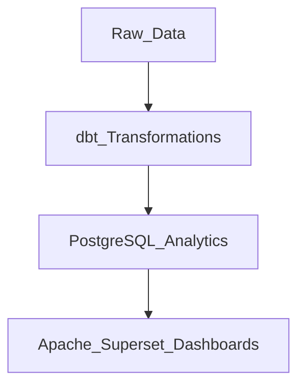

# PI-_2025_Equipe_535

This project sets up a complete analytics pipeline using **Apache Superset**, **PostgreSQL**, and **dbt**.  
The workflow is:  
```text
 Raw Data (CRM, Logs, Sensors) ──► dbt (Transformations) ──► PostgreSQL (Analytics Schema) ──► Superset (Dashboards & KPIs)
                                          │
                                          ▼
                             Python (Automation, Anomaly Detection, CI/CD)
```
flowchart LR
    A[Raw Data <br>(CRM, Sales, Logs, Sensors)]
    B[dbt <br>(Transformations, SQL Models)]
    C[PostgreSQL <br>(Raw + Transformed Data)]
    D[Superset <br>(Dashboards, KPIs, Visualization)]
    E[Python <br>(Automation, ML, Anomaly Detection, CI/CD)]

    A --> B --> C --> D
    C --> E

## Table of Contents

- [Quickstart – Superset + dbt + PostgreSQL](#quickstart--superset--dbt--postgresql)
- [1) Prerequisites](#1-prerequisites)
- [2) Get and Run Superset with Docker](#2-get-and-run-superset-with-docker)
- [3) Load Examples](#3-load-examples)
- [4) Add The First Dataset](#4-add-the-first-dataset)
- [5) Superset API Basics](#5-superset-api-basics)
- [6) Python Proof of Concept – Validate Dashboard Data](#6-python-proof-of-concept--validate-dashboard-data)
- [7) CI/CD Skeleton (GitLab)](#7-cicd-skeleton-gitlab)
- [8) Troubleshooting](#8-troubleshooting)
- [9) Useful Links](#9-useful-links)
- [Security](#security)
- [Setting up dbt with PostgreSQL](#setting-up-dbt-with-postgresql)
- [Working with the real database](#working-with-the-real-database)
- [ASCII Diagram](#ascii-diagram)


# Summary of commands 
; details below ( starting from Apache Superset – Project 110 Guide (Windows))
#  Quickstart – Superset + dbt + PostgreSQL


---

##  In 5 Minutes

1. **Start Superset (Docker)**
```bash
git clone https://github.com/apache/superset.git
cd C:\Users\superset
docker compose -f docker-compose-non-dev.yml up -d
```
Open: [http://localhost:8088](http://localhost:8088)  
Login: `admin / admin`


---

2. **Set up dbt**
```bash
cd C:\Users\<YourName>\Documents
python -m venv dbt_env
C:\Users\<YourName>\Documents\dbt_env\Scripts\activate
pip install dbt-postgres
dbt init my_project
```


---

3. **Configure PostgreSQL connection**
Create `C:\Users\<YourName>\.dbt\profiles.yml`:
```yaml
my_project:
  outputs:
    dev:
      type: postgres
      host: localhost
      user: postgres
      password: your_password_here
      port: 5432
      dbname: postgres
      schema: public
  target: dev
```

---

4. **Test connection**
```bash
cd C:\Users\<YourName>\Documents\my_project
dbt debug
```


---

5. **Run first model**
Create `models/hello_world.sql`:
```sql
SELECT 1 AS id, 'hello_dbt' AS message
```
Then run:
```bash
dbt run
```
Verify in PostgreSQL:
```sql
SELECT * FROM hello_world;
```


---

 If you see `1 | hello_dbt`, everything is working

---

 After this, we will load **real raw data** into PostgreSQL, build transformations in **dbt**, and visualize them in **Superset dashboards**.

# Apache Superset – Project 110 Guide (Windows)

### 1) Prerequisites

- Windows 10/11 with admin rights
- Docker Desktop installed and running (WSL 2 backend enabled)
- Git installed
- Python 3.11 installed (ok if 3.13 is also present)
- Chrome or Edge

Verify Docker:

```
docker version
docker run hello-world
```

---


### 2) Get and Run Superset with Docker

1. Make sure **Docker Desktop** is running.  
2. Open PowerShell and run:

```cd C:\Users\
git clone https://github.com/apache/superset.git
cd C:\Users\superset
docker compose -f docker-compose-non-dev.yml pull
docker compose -f docker-compose-non-dev.yml up -d
```

Check services:

```
docker compose ps
docker compose logs -f
```

Open ```[http://localhost:8088]```

Default credentials:  
**Username:** `admin` / **Password:** `admin`

Then create 2 files:  (that you can find on the github)
- `superset_check.py`  
- `reference_expected.csv`  

Run the Python script:   ( in the terminal of the folder in which you saved it)

```bash
python superset_check.py
```

---

### 3) Load Examples

```bash
docker compose exec superset_app superset load_examples
docker compose exec superset_app superset init
```

---

### 4) Add The First Dataset

1. In Superset UI → Data → Datasets → + Dataset  
2. Choose a database (like Postgres in the stack) or upload a CSV  
3. Create a chart and add it to a dashboard  

---

### 5) Superset API Basics

To put in your terminal

```http
POST /api/v1/security/login
GET  /api/v1/security/csrf_token
GET  /api/v1/dataset/{id}/data?format=json
POST /api/v1/chart/data
```

---

### 6) Python Proof of Concept – Validate Dashboard Data

```python
import requests, pandas as pd

BASE = "http://localhost:8088"
USER = "admin"
PWD = "admin"
DATASET_ID = 12
REFERENCE_CSV = "reference_expected.csv"

s = requests.Session()
r = s.post(
    f"{BASE}/api/v1/security/login",
    json={"provider":"db","username":USER,"password":PWD,"refresh":True},
    timeout=30,
)
r.raise_for_status()

s.headers.update({"Authorization": f"Bearer {r.json()['access_token']}"})
csrf = s.get(f"{BASE}/api/v1/security/csrf_token", timeout=30).json().get("result")
s.headers.update({"X-CSRFToken": csrf})

data = s.get(
    f"{BASE}/api/v1/dataset/{DATASET_ID}/data",
    params={"format":"json","row_limit":1000},
    timeout=60,
).json()
df_superset = pd.DataFrame(data)

df_ref = pd.read_csv(REFERENCE_CSV)

JOIN_KEYS = ["ds"]
VALUE_COL = "value"

merged = df_superset[JOIN_KEYS+[VALUE_COL]].merge(
    df_ref[JOIN_KEYS+[VALUE_COL]],
    on=JOIN_KEYS,
    how="outer",
    suffixes=("_superset","_ref")
)

merged["delta"] = merged[f"{VALUE_COL}_superset"] - merged[f"{VALUE_COL}_ref"]

merged["status"] = merged.apply(
    lambda r:
        "missing_in_ref" if pd.notna(r[f"{VALUE_COL}_superset"]) and pd.isna(r[f"{VALUE_COL}_ref"]) else
        ("missing_in_superset" if pd.isna(r[f"{VALUE_COL}_superset"]) and pd.notna(r[f"{VALUE_COL}_ref"]) else
         ("mismatch" if pd.notna(r["delta"]) and abs(r["delta"]) > 1e-9 else "match")),
    axis=1,
)

merged.to_csv("superset_vs_reference_report.csv", index=False)
print(merged["status"].value_counts())
```

Reference CSV template (`reference_expected.csv`): 

( this is just an example of a dataset to test with)

```csv
ds,value
2025-01-01,100
```

Run:

```bash
python superset_check.py
```

---

### 7) CI/CD Skeleton (GitLab)

**Test file: `test_validation.py`**

```python
import pandas as pd

def test_no_mismatches():
    df = pd.read_csv("superset_vs_reference_report.csv")
    assert not (df["status"] == "mismatch").any(), "Mismatches detected in dashboard data"
```

**Pipeline file: `.gitlab-ci.yml`**

```yaml
image: python:3.11-slim

before_script:
  - pip install requests pandas pytest python-dotenv

stages: [validate]

validate:
  stage: validate
  script:
    - python superset_check.py
    - pytest -q
```

---

### 8) Troubleshooting

1. **ConnectionRefusedError** → Superset not running:  

```bash
docker compose -f docker-compose-non-dev.yml up -d
```

2. **Pipe not found / cannot pull images** → Start Docker Desktop; enable WSL 2 backend:  

```bash
docker run hello-world
```

3. **Auth failed** → Update USER/PWD  
4. **Port 8088 in use** → Change mapping in `docker-compose-non-dev.yml`  

---


## Once we have the right database (what to modify)

In Superset (one-time setup):  
- Add DB connection  
- Expose tables as Datasets  
- Check permissions  

In the script (`superset_fetch.py`):  

```python
import requests
import pandas as pd
import json

BASE = "https://your-superset.company.com/superset"   # TODO
USER = "your_user"                                    # TODO
PWD  = "your_password"                                # TODO
DATASET_ID = 0                                        # TODO

session = requests.Session()
login = session.post(
    f"{BASE}/api/v1/security/login",
    json={"username": USER, "password": PWD, "provider": "db", "refresh": True},
    timeout=30,
)
login.raise_for_status()
print("Logged in")

payload = {
    "datasource": {"id": DATASET_ID, "type": "table"},
    "queries": [{
        "columns": ["col1", "col2", "col3"],  # TODO
        "metrics": [],                        # TODO
        "filters": [],                        # TODO
        "orderby": [],
        "row_limit": 1000
    }],
    "result_format": "json",
    "result_type": "results",
}

data_resp = session.post(f"{BASE}/api/v1/chart/data", json=payload, timeout=60)
data_resp.raise_for_status()
```
superset.apache.org/docs/

### 9)	Useful Links

API Overview: https://superset.apache.org/docs/api

GitHub Repo: https://github.com/apache/superset


## Security

How we protect the data :

🔹 Secure Access & Authentication

We restrict access to Superset through user accounts and role-based permissions. Each user has credentials, and roles ensure that sensitive dashboards or datasets are only visible to authorized people. This prevents unauthorized access.
________________________________________
🔹 Data Connections with Least Privilege

Superset connects to databases using read-only accounts. This means users can query and visualize data but cannot modify or delete it. Access to the underlying data sources is minimized to reduce risks.
________________________________________
🔹 Network & Encryption

When deployed in production, Superset is placed behind a secure network (VPN or firewall) and served via HTTPS. This ensures that data in transit between the user’s browser and Superset is encrypted, protecting confidential information from interception

Test with SuperSet :


## For the project, Superset is only the Frontend, we will also need

PostgreSQL → store data & anomaly results. ( Its SQL SHell)

dbt → transformations + SQL modeling. (a developer framework for SQL inside the database.)

Python scripts (with scikit-learn / PyOD) → anomaly detection logic.

# Setting up dbt with PostgreSQL

-> setting up dbt with PostgreSQL, creating a project, and running first models.

---

## 1. Create a Python virtual environment
```bash
cd C:\Users\<YourName>\Documents
python -m venv dbt_env
```

---

## 2. Activate the environment
```bash
C:\Users\<YourName>\Documents\dbt_env\Scripts\activate
```
You should now see `(dbt_env)` at the start of your command line.

---

## 3. Install dbt for PostgreSQL
```bash
pip install dbt-postgres
dbt --version
```
If successful, you’ll see the installed dbt core and postgres adapter.

---

## 4. Initialize a new dbt project
```bash
dbt init my_project
```
This creates a folder `my_project/` with the starter configuration.

---

## 5. Configure the database connection
dbt needs a profile to connect to PostgreSQL.

1. Go to your home directory:
   ```bash
   C:\Users\<YourName>\.dbt\
   ```
2. Create a file called `profiles.yml` with this content:

   ```yaml
   my_project:
     outputs:
       dev:
         type: postgres
         host: localhost
         user: postgres
         password: your_password_here
         port: 5432
         dbname: postgres
         schema: public
     target: dev
   ```

⚠️ Replace `your_password_here` with your actual PostgreSQL password.

---

## 6. Test the connection
From inside your project folder:
```bash
cd C:\Users\<YourName>\Documents\my_project
dbt debug
```
If everything is correct, you should see **“All checks passed!”**

---

## 7. Create your first model
Inside `my_project/models/`, create a file called `hello_world.sql`:

```sql
SELECT 1 AS id, 'hello_dbt' AS message
```

---

## 8. Run the model
```bash
dbt run
```
dbt will build your model as a table/view inside PostgreSQL.  
You should see logs like:

```
1 of 1 OK created sql view model public.hello_world ... [CREATE VIEW in 0.18s]
Completed successfully
```

---

## 9. Verify in PostgreSQL
Open the `psql` shell and run:
```sql
SELECT * FROM hello_world;
```

Output:
```
 id |  message
----+-----------
  1 | hello_dbt
```

---

##  Working with the real database

Once a real database is available (instead of the simple `hello_world` model), the workflow is:

1. **Raw data**
   - Raw data = the original, unprocessed tables loaded into the database from source systems (sales, CRM, sensors, logs, etc.).
   - These tables often contain messy formats, inconsistent naming, duplicates, or missing values.
   - Example (raw table `orders_raw`):
     ```
     id | cust_id | amt | date_str
     1  |  101    |  50 | 2023-01-01
     2  |  101    |  30 | 01/02/2023
     3  |  102    | NULL| 2023-01-05
     ```

2. **Define sources**
   - In `models/`, create a `src.yml` file:
     ```yaml
     version: 2
     sources:
       - name: raw
         tables:
           - name: orders_raw
           - name: customers_raw
     ```

3. **Build transformation models**
   - Write SQL in `models/` to clean, join, or aggregate data.
   - Example `models/orders_clean.sql`:
     ```sql
     SELECT
         id,
         cust_id AS customer_id,
         COALESCE(amt, 0) AS amount,
         CAST(date_str AS DATE) AS order_date
     FROM {{ source('raw', 'orders_raw') }}
     ```

   - Clean result:
     ```
     id | customer_id | amount | order_date
     1  | 101         |   50   | 2023-01-01
     2  | 101         |   30   | 2023-01-02
     3  | 102         |    0   | 2023-01-05
     ```

4. **Run dbt**
   ```bash
   dbt run
   ```
   - dbt creates new tables/views (like `orders_clean`) inside your target schema.

5. **Use the results**
   - These dbt models can now be queried directly in PostgreSQL.
   - You can connect BI tools like **Superset** or **Power BI** to visualize the dbt-built tables.

---

With this workflow, dbt acts as the **transformation layer**:  
it takes raw data from your database, applies business logic, and creates clean, analytics-ready tables for dashboards and reports.

## ASCII Diagram 

```text
        ┌─────────────┐
        │   Raw Data  │   (sales, CRM, logs, sensors)
        └──────┬──────┘
               │
               ▼
        ┌─────────────┐
        │   dbt       │   (SQL transformations, cleaning, joins)
        └──────┬──────┘
               │
               ▼
        ┌─────────────┐
        │ PostgreSQL  │   (analytics schema with dbt models)
        └──────┬──────┘
               │
               ▼
        ┌─────────────┐
        │ Superset    │   (dashboards, KPIs, anomaly visualization)
        └─────────────┘
```




